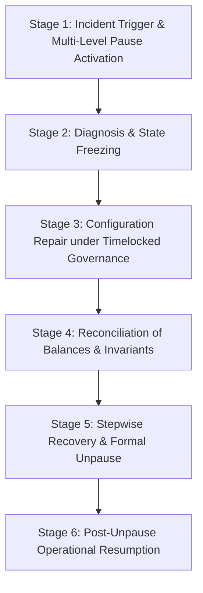

# Emergency Recovery and Unpause Drill Runbook

## Overview

This runbook specifies the protocol-critical operational procedures for conducting end-to-end emergency recovery and unpause drills (V2-SC-118). It ensures operational readiness to diagnose incidents, execute timelocked configuration repairs, reconcile protocol balances and state invariants, execute stepwise recovery, and restore normal operations without risking asset conservation, settlement integrity, or authorization boundaries.

---

## Drill Objectives

1. **Validate Separation of Powers:** Verify that rapid response roles (`EMERGENCY_COUNCIL`) can swiftly freeze operations but cannot unilaterally lift pauses or mutate treasury allocations.
2. **Demonstrate State Freezing:** Verify that high-risk mutations (claims, staking, verification) and financial operations (treasury transfers, reward distribution, withdrawals) fail-closed during active pauses.
3. **Exercise Timelocked Repair:** Verify that configuration and parameter adjustments strictly adhere to governance timelock delays (`MIN_ECONOMIC_PARAMETER_TIMELOCK = 2 days`) without shortcuts.
4. **Reconcile Invariants:** Verify that on-chain assets, pool custody, active claim terms, and user balances are completely conserved and uncorrupted during and after pause.
5. **Execute Phased Recovery:** Enforce sequential execution of post-unpause recovery verification steps (1 → 2 → 3) prior to full recovery finalization.
6. **Resume Normal Operations:** Ensure full protocol operational capability is restored post-drill with clean event audit trails.

---

## 6-Stage Drill Procedure



### Stage 1: Incident Trigger & Pause Activation

- **Actors:** `EMERGENCY_COUNCIL` (or `TIMELOCK_CONTROLLER` for Level 1).
- **Actions:**
  1. Detect simulated anomaly (e.g. invalid claims flood or oracle divergence).
  2. Call `EmergencyController.activatePause(level, reason, proposalRef)` or `EmergencyControls.pause(scope)`.
  3. Escalate to Level 2 (Financial) or Level 3 (Shutdown) if asset loss risk is detected.
- **Verification Invariants:**
  - `EmergencyPauseActivated` event emitted with caller, level, reason, and proposal reference.
  - `EmergencyActionRecorded` event emitted with unique action hash.
  - `currentPauseLevel` matches target level.
  - `recoveryComplete` is set to `false`.
  - Non-authorized accounts (and council attempts to unpause) revert with strict error selectors.

### Stage 2: Diagnosis & State Freezing

- **Actors:** Security Response Team & DAO Governance.
- **Actions:**
  1. Query `isOperationAllowed(opType)` across all operation types:
     - Level 1: `claim_creation`, `staking`, `verification_submission` are blocked.
     - Level 2: `withdrawal`, `reward_distribution`, `treasury_transfer` are blocked in addition to Level 1.
     - Level 3: All operations are blocked except `governance_recovery`.
  2. Perform read-only queries against protocol registries to diagnose state without mutation.
  3. Inspect `getEmergencyHistory()` audit log.
- **Verification Invariants:**
  - Mutation calls to protected modules revert with `OperationPaused`.
  - Read-only interfaces remain accessible.

### Stage 3: Configuration Repair under Timelocked Authorization

- **Actors:** `DAO_GOVERNANCE` / Timelock Proposer & Executor.
- **Actions:**
  1. Formulate repaired parameter configuration (e.g. updated fee schedules, slash percentages, or staking bounds in `ParameterVersionRegistry`).
  2. Call `ParameterVersionRegistry.proposeNewVersion(parameters)`.
  3. Enforce mandatory timelock delay: early execution attempts prior to `executeAfter` MUST revert with `TimelockNotExpired`.
  4. Advance block time past the timelock window (`>= 2 days`).
  5. Execute `ParameterVersionRegistry.activateVersion(versionId)`.
- **Verification Invariants:**
  - `VersionProposed`, `VersionQueued`, and `VersionActivated` events emitted.
  - `currentActiveVersionId` points to the repaired version.

### Stage 4: Reconciliation of Balances & Invariants

- **Actors:** Treasury Auditors & Protocol Verification Engineers.
- **Actions:**
  1. Reconcile total protocol token custody against recorded pool obligations:
     $$\sum \text{PoolBalances} == \text{ContractTokenBalance}$$
  2. Verify active claim non-retroactivity:
     - Claims registered under genesis/prior versions continue referencing their frozen version ID.
     - New claims created after repair register with the new active version ID.
- **Verification Invariants:**
  - Zero asset leakage, zero double-counting, zero phantom balances.
  - Immutability of active claims is strictly preserved.

### Stage 5: Stepwise Recovery Execution & Formal Unpause

- **Actors:** `DAO_GOVERNANCE` (Unpause) and `RECOVERY_EXECUTOR` (Recovery Steps).
- **Actions:**
  1. `DAO_GOVERNANCE` calls `EmergencyController.liftPause(proposalRef)`.
     - Emits `EmergencyPauseLifted(previousLevel, caller, proposalRef)`.
     - Sets `currentPauseLevel = LEVEL_NORMAL`.
     - `recoveryComplete` remains `false`.
  2. `RECOVERY_EXECUTOR` executes sequential recovery:
     - **Step 1:** Call `completeRecoveryStep("Step 1: Configuration repair verified")`.
       - Emits `RecoveryStepCompleted(1, executor, description)`.
     - **Step 2:** Call `completeRecoveryStep("Step 2: Balance invariants reconciled")`.
       - Emits `RecoveryStepCompleted(2, executor, description)`.
     - **Step 3:** Call `completeRecoveryStep("Step 3: All systems operational")`.
       - Emits `RecoveryStepCompleted(3, executor, description)`.
       - Emits `RecoveryFinalised(executor, timestamp)`.
       - Resets `recoveryStep = 0` and sets `recoveryComplete = true`.
- **Verification Invariants:**
  - Non-governance callers cannot lift pause.
  - Recovery steps cannot be executed while still paused.
  - Non-authorized executors cannot submit recovery steps.
  - Steps must be executed in strict ascending sequence (1 → 2 → 3); skipping steps reverts.

### Stage 6: Post-Unpause Operational Resumption

- **Actors:** General Protocol Participants.
- **Actions:**
  1. Verify `isOperationAllowed` returns `true` for all operations.
  2. Execute sample transactions: create claim, stake tokens, submit verification, and execute withdrawals.
  3. Validate that new transactions apply the repaired configuration parameters.
- **Verification Invariants:**
  - All protected operations execute successfully.
  - No residual lockout states remain.

---

## Test & Automation Suite

The drill procedures are fully implemented as automated, repeatable tests:

| Test Suite | Path | Description |
|---|---|---|
| **Unit & Integration Drill** | `test/governance/EmergencyRecoveryDrills.t.sol` | End-to-end 6-stage lifecycle, separation of powers, and event checks |
| **Property Fuzz Tests** | `test/fuzz/EmergencyRecovery.fuzz.sol` | Invariant testing of monotonic restriction, role boundaries, and recovery ordering |
| **Module Conformance** | `test/v2/V2ModuleConformance.t.sol` | Conformance of V2 `EmergencyControls` with `IEmergencyControls` & ERC-165 |
| **Conformance Fuzz** | `test/fuzz/V2ConformanceFuzz.t.sol` | Negative-space interface checks for `EmergencyControls` |

To run the drills locally:
```bash
# Run the complete emergency recovery drill suite
forge test --match-contract EmergencyRecoveryDrillsTest -vvv

# Run fuzz tests for emergency properties
forge test --match-contract EmergencyRecoveryFuzzTest -vvv
```
